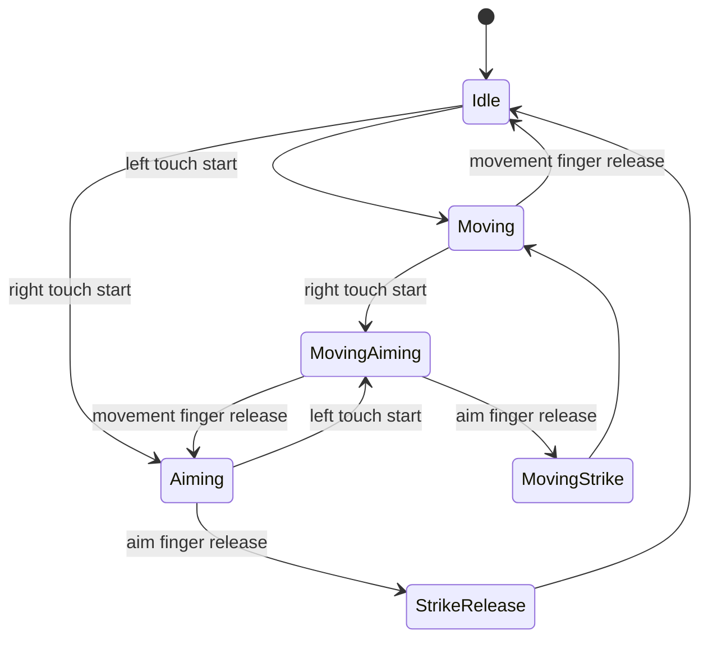

# Touch Control Redesign

## Root Cause

Current touch control failure is architectural, not a small tuning bug.

- `project.godot` has no match gameplay Input Map entries for mobile movement, aim, charge, or strike. The only listed input actions are coach keys.
- `scenes/interactive_match/interactive_match.gd::_collect_input()` reads `Input.is_mouse_button_pressed(MOUSE_BUTTON_LEFT)`, `Input.is_mouse_button_pressed(MOUSE_BUTTON_RIGHT)`, `Input.get_axis("ui_left", "ui_right")`, and button flags. It does not handle `InputEventScreenTouch` or `InputEventScreenDrag`.
- `scenes/interactive_match/interactive_match.gd::_build_touch()` creates visual `ColorRect` joystick/pad nodes and rectangular `Button`s, but those nodes do not own fingers and do not implement `_gui_input()`.
- `scenes/interactive_match/interactive_match.gd::_unhandled_input()` only handles `ui_cancel`.
- Movement and aim share mouse state. A second finger cannot be independently tracked.
- The current left/right zones are inferred from `mouse.x < viewport_width * 0.42`, so touch ownership depends on one pointer-like position, not finger index.
- Touch visuals live as ordinary `Control`s in the same tree as gameplay/HUD. `mouse_filter` is not explicitly assigned, so event routing is accidental.
- Camera-aware `_map()` is used for world objects. UI controls are screen-space Controls, but aim calculations mix `get_viewport().get_mouse_position()` with `_map(engine.state["ball"]["pos"])`, tying aim behavior to current camera transform.

## Answers To Required Questions

1. Joystick only receives mouse-style state, not real touch ownership.
2. Touch is effectively treated as mouse input, so a second finger cannot be reliably preserved.
3. Yes. `move_vector`, `aim_vector`, and `action_flags` are global shared state with no per-finger ownership.
4. Possibly. HUD/buttons are normal Controls and only buttons intentionally consume events; decorative controls do not explicitly ignore events.
5. Likely risk. Stretch mode is `canvas_items` with aspect `expand`, but no touch coordinate normalization layer exists.
6. Yes for aim. Aim compares viewport mouse position to camera-transformed ball position.
7. Yes. There is no release tracking for a movement or aim finger, so release outside a visual zone cannot safely reset the owner.
8. No `TouchScreenButton` is present, but Button Controls and custom visual Controls overlap the intended touch areas.
9. `_input()` is not implemented. `_unhandled_input()` runs only for cancel.
10. The engine movement is connected to `_collect_input()["move"]`, but that vector is not produced by real joystick drag on device.

## Finger Ownership

Required state:

```gdscript
movement_touch_id: int = -1
aim_touch_id: int = -1
movement_origin: Vector2
movement_vector: Vector2
aim_origin: Vector2
aim_vector: Vector2
charge: float
is_aiming: bool
```

Ownership rules:

- First finger beginning in the left movement zone becomes `movement_touch_id`.
- First different finger beginning in the right aim zone becomes `aim_touch_id`.
- A movement finger can only update movement state.
- An aim finger can only update aim/charge/strike state.
- Releasing a finger only clears the state owned by that finger.
- A right-side finger must never overwrite `movement_touch_id`.
- A left-side finger must never cancel `aim_touch_id`.

## State Diagram



## Event Routing

- Implement touch handling in a dedicated `MatchTouchController` node.
- Use `_input(event)` or an input-forwarding node that sees raw `InputEventScreenTouch` and `InputEventScreenDrag` before HUD consumption.
- Put HUD and controls in a `CanvasLayer` independent of camera.
- Decorative HUD panels and joystick visuals: `mouse_filter = IGNORE`.
- Real buttons only, such as pause: `mouse_filter = STOP`.
- Avoid rectangular Strike/Switch buttons for primary action. Strike should be aim-finger release.

## Coordinate Spaces

- Touch state uses viewport/screen coordinates only.
- Movement joystick uses viewport-space origin and drag vector.
- Aim direction uses viewport-space drag direction, converted to world aim only when passed to the engine.
- Camera transform must not affect joystick origin, touch zones, or drag distances.
- World-to-screen mapping remains only for gameplay visuals.

## Multi-touch Sequence

1. Finger 0 touches lower-left zone.
2. Assign `movement_touch_id = 0`.
3. Drag finger 0; update `movement_vector`.
4. Finger 1 touches lower-right zone.
5. Assign `aim_touch_id = 1`.
6. Drag finger 1; update `aim_vector` and `charge`.
7. Finger 1 releases; emit one strike using the stored aim/charge.
8. Finger 0 remains down; movement continues.
9. Finger 0 releases; movement vector resets to zero.

## Edge Cases

- Release outside zone must still clear the owning finger.
- If movement finger crosses into right side, it still remains movement until release.
- If aim finger crosses into left side, it still remains aim until release.
- If a third finger touches, ignore it unless one owner slot is free.
- If pause opens, clear both touch owners.
- If app focus is lost, clear both touch owners.
- If viewport resizes, keep active origins in current viewport coordinates or cancel touches safely.

## Device Test Plan

- Install the APK on a real phone.
- Confirm no floating overlay is visible.
- Hold left thumb and move continuously for 10 seconds.
- While still moving, hold right thumb, drag aim, and release to strike.
- Confirm movement continues during aim.
- Confirm strike triggers only on aim finger release.
- Confirm movement stops only when movement finger releases.
- Confirm pause works and clears ownership.
- Capture clean screenshot and 20-40 second device video.
- Collect package-filtered logcat, meminfo, and gfxinfo.
